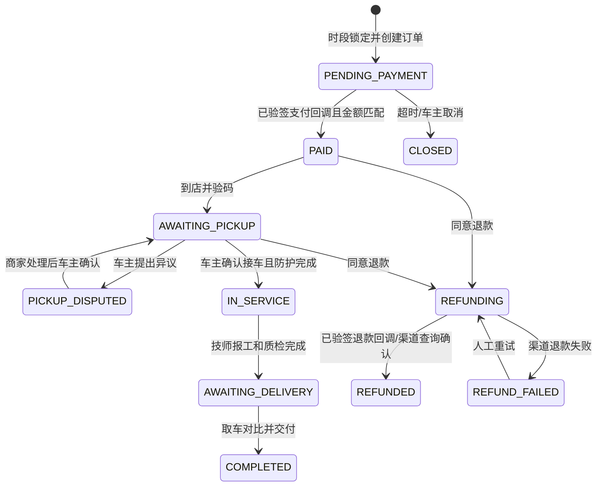

# S0 业务接口与状态契约 v0.1

> 2026-10-02。此文件定义 S0 后续实现的接口草案；标【假设】的规则是工程口径，尚未与真实微信登录、支付、短信、AI/OCR 服务联调。交付文档 §8.3 的 43 个核心 API 仍在 `S0_TRACEABILITY.csv` 中逐项追踪；车主/技师登录路径按原文恢复为 `/api/auth/wx-login`。

单测试号下的车主/技师身份绑定、角色权限与迁移顺序详见 [微信身份设计](WECHAT_IDENTITY_DESIGN.md)。

## 通用约束

- HTTPS + JSON；业务响应统一为 `{ "code": 0, "message": "success", "data": {}, "request_id": "UUID" }`。HTTP 401/403/404/429/5xx 与 `40100/40300/40400/42900/50000` 对应；业务冲突用 HTTP 409 和细分业务码。
- 除登录、支付回调及健康检查外，请求携带 `Authorization: Bearer <token>`。服务端按角色与资源归属再校验；车主 `user_id`、商家 `merchant_id`、技师 `technician_id` 不从请求正文信任。越权返回 `40300`。
- 所有客户端写接口使用 `Idempotency-Key: UUID`；按主体、方法、路径和 key 保存请求摘要与结果 24 小时。同 key 同请求返回首次结果，同 key 不同内容返回 `40001`。第三方回调以渠道事件 ID 去重，异步任务以业务事件 ID 去重。
- 日期时间使用 ISO 8601 且带时区；数据库存 UTC。金额单位为元，字符串格式两位小数，在数据库使用 `DECIMAL(10,2)`，不得使用浮点数计算。分页 `page` 默认 1、`page_size` 默认 20，最大 100。
- 【假设】所有状态变更需记录操作者、时间、原状态、新状态、请求 ID；未列出的状态跳转返回 `40001`，并不改变原状态。

## 订单、支付与退款状态

【假设】支付记录状态 `CREATED/PENDING/SUCCEEDED/FAILED/CLOSED`，退款记录状态 `REQUESTED/PROCESSING/SUCCEEDED/FAILED`，均与订单状态分开存储。支付回调可以迟到或重复：验签、商户号、订单号、金额和币种全部一致才允许从待支付转已支付；订单已关闭时记录异常并触发渠道退款核对，不重新开单。退款成功后释放已预占但未核销的券，不能重复返券。每日按渠道流水与本地支付/退款记录核对；差异进入人工处理队列，不自动改写历史金额。

## 新增接口草案

以下接口是 §8.3 未完整列出的支撑契约。字段名及路径在正式 OpenAPI 中保持一致；商家/运营账号登录接口与车主手机号登录分开。

| 方法与路径 | 角色 | 关键请求/响应字段 | 前置条件与失败处理 |
| --- | --- | --- | --- |
| `POST /api/auth/sms-code` | 商家/需短信验证的账号 | `phone, purpose` → `retry_after_seconds` | 60 秒内重复发送和每日超限返回 `42900`；真实短信凭据缺失时不可伪装发送成功 |
| `POST /api/auth/wx-login` | 车主/技师 | 微信临时 `code, role` → `access_token, refresh_token, expires_in, user` | 服务端换取微信身份并关联本平台用户；车主手机号绑定与技师首次工号绑定须完成相应校验；禁用账号拒绝。微信平台字段及授权方式待资质和开发环境确认 |
| `POST /api/auth/staff-login` | 商家/运营 | `account, password, second_factor` → token 与角色 | 密码 bcrypt；商家状态和运营权限二次校验 |
| `GET /api/order/slots` | 车主 | `merchant_id, project_id, date` → `slot_id, starts_at, ends_at, capacity_left` | 项目下架或无可用时段返回空列表 |
| `POST /api/order/create` | 车主 | `merchant_project_id, vehicle_id, slot_id, coupon_id?` → `order_id, amount_due, expires_at` | 服务端重算价格并保存项目/商家/报价快照；锁时段及预占券必须同一事务；冲突返回 `40001` |
| `POST /api/payments/create` | 车主 | `order_id, channel` → `payment_id, channel_payload, expires_at` | 只允许待支付订单；同订单重复创建返回已有有效支付记录 |
| `POST /api/payments/callback/{channel}` | 支付渠道 | 渠道原始回调 → 渠道要求的确认响应 | 不使用客户端 token；验签、金额与事件去重；验签失败拒绝并告警 |
| `GET /api/payments/{id}` | 车主本人/本店商家 | 状态、金额、渠道流水号 | 查询前校验订单归属；渠道超时显示处理中，不推断成功 |
| `POST /api/refunds/create` | 车主/本店商家 | `order_id, reason` → `refund_id, status` | 已支付且符合取消规则；金额不得超过实际支付余额；重复申请按幂等键返回原结果 |
| `POST /api/refunds/callback/{channel}` | 支付渠道 | 渠道原始回调 → 确认响应 | 验签及退款号、金额校验；重复事件不重复改订单和返券 |
| `GET /api/admin/reconciliation` | 授权运营 | `date, channel` → 本地/渠道金额与差异列表 | 仅财务权限可见；敏感流水号脱敏，导出留审计 |
| `POST /api/coupon/reserve` | 车主 | `coupon_id, order_id` → `reservation_id, expires_at` | 校验归属、范围、金额、有效期；一券只允许一个有效预占 |
| `POST /api/coupon/release` | 系统/订单所有者 | `order_id` → 当前券状态 | 订单关闭或支付失败时释放；已核销券不得释放 |
| `POST /api/order/verify` | 本店商家 | `order_id, verify_code` → 订单状态 | 验码后一次性消费；过期/错误/跨店返回错误且留审计 |
| `POST /api/merchant/apply` | 商家申请人 | 资质文件引用、店名、品类、区域 → `application_id` | 文件必须是私有对象引用；重复申请按主体去重 |
| `POST /api/merchant/projects` | 本店商家 | `standard_project_id, price, status` → `merchant_project_id` | 已审核商家可选品；保留历史报价版本，不修改已下单快照 |
| `POST /api/merchant/orders/{id}/assign` | 本店商家 | `technician_id` → `assignment_id` | A5.2 后端：接车证据齐全、车主确认且无争议；仅本店有效且当前 AppID 已绑定微信的技师；防护在 A6 报工校验 |
| `GET /api/notifications` | 已登录用户 | 分页通知列表 | 只返回本人/本店可见通知，失败时不阻断主流程 |

## 预约时段、券、佣金与通知

A5 已形成[派工与技师接口契约](TECHNICIAN_DISPATCH.md)及[规格](../superpowers/specs/2026-10-08-a5-dispatch-design.md)：使用员工 ID 归属，技师本人接单才开始施工。六个后端接口已编码，界面在 A5.3 接入；按 Spec F15 修正了旧草案的防护阻断时点。

- 【假设】时段容量以 `merchant_id + slot_id` 为键，在创建订单事务内锁定；待支付订单 15 分钟未支付则关闭并释放时段和券。支付回调到达时再次检查订单状态，过期成功付款进入人工退款核对。
- 【假设】券状态为 `AVAILABLE/RESERVED/USED/EXPIRED`；支付前只预占，不核销。订单支付成功并在服务完成时核销；订单取消或支付失败释放。领券数量和有效期由券模板决定，不能用前端缓存判断库存。
- 【假设】佣金按订单实际支付金额计算，比例与免佣期由带生效时间的商家政策表配置；创建订单保存政策快照，退款按已收佣金反向冲销，佣金金额以分为单位四舍五入到分。默认比例和免佣天数不写死，未配置时订单可成交但佣金结算进入待人工配置状态。
- 通知事件至少包含 `event_id, recipient_type, recipient_id, template_key, payload, created_at`。先持久化事件，再异步投递站内通知；失败可重试，去重键为事件 ID 与接收人。短信仅用于已审核模板和明确触发场景，不用作唯一履约通知。

## 后续验证

正式实现前，S0 需把本草案拆成机器可校验的 OpenAPI 和数据库迁移。M0 示例 API 应覆盖登录、一个受保护资源的本人/越权访问及重复写请求。S2/S4 联调时再用真实渠道沙箱与角色账号验证回调验签、退款、时段竞争、券预占及跨店派工。
